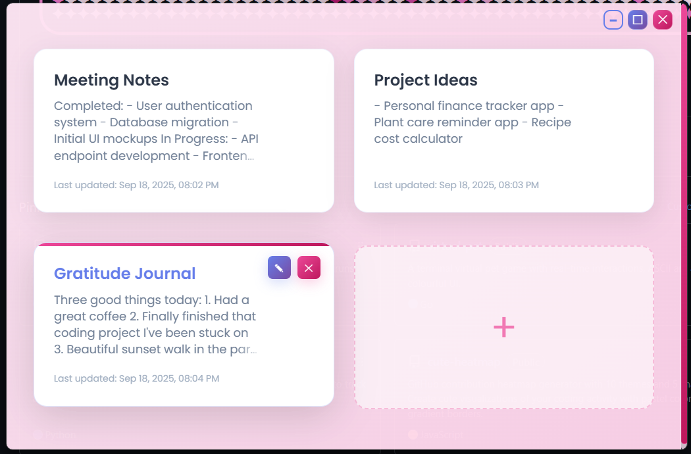
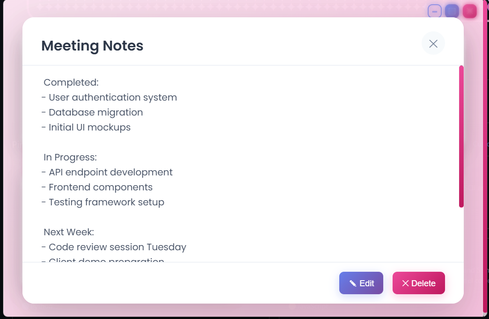
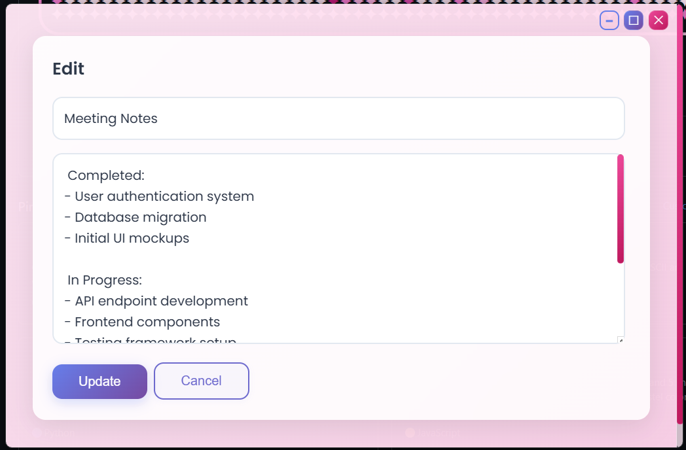

# Notes App

A cute, minimalist notes application built with Tauri (Rust), React, and TypeScript. Features a modern glass-morphism design with custom window controls.



## Features

- **Glass Morphism UI** - Frosted glass effects with subtle blur and opacity
- **Note Management** - Create, edit, and delete notes seamlessly  
- **Custom Title Bar** - Native-feeling window controls
- **Pink Theme** - Elegant color palette with gradients
- **Responsive Grid** - Clean two-column layout for notes
- **Note Previews** - Quick content glimpse with full modal view



## Tech Stack

- **Frontend**: React + TypeScript + Vite
- **Backend**: Rust (Tauri)
- **Styling**: Custom CSS with modern effects
- **Desktop**: Native window management



## Getting Started

```bash
# Clone the repository
git clone https://github.com/Emmyme/cute-notes
cd notes-app

# Install dependencies
npm install

# Start development server
npm run tauri dev

# Build for production
npm run tauri build
```

---

*A modern take on note-taking with beautiful design and smooth functionality.*
